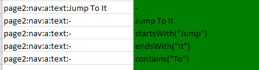
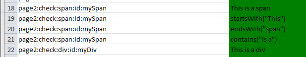

----
template: sc-test.html
title: SCS Test Docs
----

### SC-Test - Quick Start Guide

##### Version 1.6

Example Test Sheet:

#### The Basics - Structure

* Define your **Tests** in a **Sheet** in an Excel file
* A **Sheet** uses the first column to define the **Test Steps** as a series of actions to perform in executing the **Test**
* **Tests** are then defined in the subsequent columns to the right of the Test Steps and define values to be used for each **Test Step**
* You can use multiple **Sheets** to add structure to your tests. E.g. "Happy Days Paths", "Error Cases", etc

#### Test Execution

* Tests are executed sequentially reading tests in each tab and then in each column left to right
* The input file is then copied to produce a colour coded output file showing the results of the tests which includes:
   * A summary sheet showing start and end time and duration of the test execution
   * Copies of the original sheets with:
      * Green Cells - have executed successfully
      * Red Cells - have failed and caused the remainder of that test to be skipped
      * Pale Green - show data captured from the test execution
   * In addition screenshots of the state of the browser at the time a test failed are provided for analysis 
	
 
Example Results Sheet 
   
   
   

#### The Basics - Test Steps (that aren't really steps)

* **Enabled** The first row always defines whether the test should be run or not allows tests to be commented out easily: [true|false]
* **Comments** Steps whose name starts with a `//` are ignored at execution time - these allow you to add columns for commenting your tests

#### The Basics - Test Steps

Steps follow the form:

` page : action : detail : locatingAttribute : locatingAttributeValue `
  (Note the above includes spaces for illustration only)

e.g. `homePage:nav:link:href:/account/list` or `page6:enter:input:id:title`

* The elements to a step are separated by the `:` character and define what sort of Web Element is to be used in the **Test Step** and what action should be taken.
* The Page attribute is arbitrary and for reference purpose only its recommended to use meaningful Page Names such as "homePage" or loginPage. 
* Other Element are discussed in the following sections 

#### Creating a browser
To start, create a browser to run your tests:

<table>
	<tr><td></td><td></td></tr>
	<tr>
		<td>start:Browser:-:-:-</td>
		<td>ff</td>
	</tr>
	<tr><td></td><td></td></tr>
</table>

* Value: define the browser you want to test against options are `[ff, chrome, ie]`
* Action: Browser	
* Detail: -	
* Locating Attribute: -
* Locating Attribute Value: -

#### Navigation

##### Go to a defined URL

<table>
	<tr><td></td><td></td></tr>
	<tr>
		<td>page0:nav:url:-:-</td>
		<td>http://my.site.com</td>
	</tr>
	<tr><td></td><td></td></tr>
</table>

* Value: any valid URL
* Action: nav
* Detail: url	
* Locating Attribute: -
* Locating Attribute Value: -

#### Click on a button

==NOTE: this is for html elements that start `<button ` as opposed to elements that start `input` for the latter see the section on form submission==

<table>
	<tr><td></td><td></td></tr>
	<tr>
		<td>page1:nav:button:id:Login</td>
		<td>-</td>
	</tr>
	<tr><td></td><td></td></tr>
</table>

* Value: `-`
* Action: nav	
* Detail: button	
* Locating Attribute: Any attribute of the `<button>`web element 
* Locating Attribute Value: Value of the attribute specified in `Locating Attribute`

#### Click on a hyperlink

Example selecting link by attribute "href":

<table>
	<tr><td></td><td></td></tr>
	<tr>
		<td>page2:nav:a:href:/accounts/create</td>
		<td>-</td>
	</tr>
	<tr><td></td><td></td></tr>
</table>

Example selecting link by text of link:

<table>
	<tr><td></td><td></td></tr>
	<tr>
		<td>page2:nav:a:text:Accounts</td>
		<td>-</td>
	</tr>
	<tr><td></td><td></td></tr>
</table>

Example of selecting a link by variable text

<table>
	<tr><td></td><td></td></tr>
	<tr>
		<td>page2:nav:a:text:-</td>
		<td>$LINK_TEXT</td>
	</tr>
	<tr><td></td><td></td></tr>
</table>

* Value, either: 
  * `-`
  * The text of the link (can be populated via a variable)
  * Part of the text of the link when using:
     * startsWith("My Link Text Starts Like...")
	 * endsWith("...and Ends Here")
	 * contains("the middle")
* Action: nav	
* Detail: a	
* Locating Attribute: Any attribute of the `<a>`web element OR `text`
* Locating Attribute Value: Value of the attribute specified in `Locating Attribute` or the text of the link where text is used as the `Location Attribute` or `-` where link text is specifed in Value

##### Further Examples

#### Working with Forms
##### Input fields:

<table>
	<tr><td></td><td></td></tr>
	<tr>
		<td>//Basic text entry</td>
		<td>-</td>
	</tr>

	<tr>
		<td>page1:enter:input:id:username</td>
		<td>myUserName</td>
	</tr>
	
	<tr>
		<td>//Clear the field first and then set the text</td>
		<td>-</td>
	</tr>

	<tr>
		<td>page1:enter:input:id:age</td>
		<td>%BLANK%</td>
	</tr>
	
	<tr>
		<td>page1:enter:input:id:age</td>
		<td>35</td>
	</tr>
	
	
	<tr><td></td><td></td></tr>
</table>

* Value, either: 
   * text to be entered into the form element. Ensure in Excel the format of the cell is set to `text`
   * any variable in the for `$MY_VAR` typically set by a print Test Step
   * %BLANK% to blank out the contents of the input field
* Action: enter	
* Detail: input	
* Locating Attribute: Any attribute of the `<input>`web element 
* Locating Attribute Value: Value of the attribute specified in `Locating Attribute` 

##### Text Areas:

<table>
	<tr><td></td><td></td></tr>
	<tr>
		<td>page4:enter:textarea:name:address</td>
		<td>10,School Lane</td>
	</tr>
	<tr><td></td><td></td></tr>
</table>

* Value, either: 
   * text to be entered into the form element. Ensure in Excel the format of the cell is set to `text` line breaks can be included
   * any variable in the for `$MY_VAR` typically set by a print Test Step
   * %BLANK% to blank out the contents of the input field
* Action: enter	
* Detail: textarea	
* Locating Attribute: Any attribute of the `<input>`web element 
* Locating Attribute Value: Value of the attribute specified in `Locating Attribute` 

##### Select fields:
<table>
	<tr><td></td><td></td></tr>
	<tr>
		<td>page1:enter:select:id:salutation</td>
		<td>Dr</td>
	</tr>
	<tr><td></td><td></td></tr>
</table>

* Value, either: 
   * needs to specify the exact text of `value` attribute for the required entry in the select box. Note this may be different from the visible form
   * any variable in the for `$MY_VAR` typically set by a print Test Step
* Action: enter	
* Detail: select
* Locating Attribute: Any attribute of the `<select>`web element 
* Locating Attribute Value: Value of the attribute specified in `Locating Attribute` 

##### Radio Buttons:

<table>
	<tr><td></td><td></td></tr>
	<tr>
		<td>page7:enter:radio:name:myRadioButton</td>
		<td>Coffee</td>
	</tr>
	<tr><td></td><td></td></tr>
</table>

* Value, either: 
   * needs to specify the exact text of `value` attribute for the radio button required
   * any variable in the for `$MY_VAR` typically set by a print Test Step
* Action: enter	
* Detail: radio
* Locating Attribute: name
* Locating Attribute Value: Value of the name attribute

##### Check Boxes:

<table>
	<tr><td></td><td></td></tr>
	<tr>
		<td>page2:enter:checkbox:name:hasCar</td>
		<td>true</td>
	</tr>
	<tr><td></td><td></td></tr>
</table>

* Value, either: 
   * specify the exact text of `value` attribute for the check box
   * any variable in the for `$MY_VAR` typically set by a print Test Step 
* Action: enter	
* Detail: checkbox
* Locating Attribute: name
* Locating Attribute Value: Value of the name attribute

##### Submitting Form / Clicking an `<Input` button:

<table>
	<tr><td></td><td></td></tr>
	<tr>
		<td>page3:submit:form:name:new</td>
		<td>-</td>
	</tr>
	<tr><td></td><td></td></tr>
</table>

* Value: `-`
* Action: enter	
* Detail: radio
* Locating Attribute: name
* Locating Attribute Value: Value of the name attribute

#### Checking values:
Used to assert that an expected value is actually present in a given web element. 

<table>
	<tr><td></td><td></td></tr>
	<tr>
		<td>page3:check:span:id:totalChargeable</td>
		<td>512.76</td>
	</tr>
	<tr><td></td><td></td></tr>
</table>

* Value: 
  * The expected value OR
  * Part of the text of the link when using:
     * startsWith("My Link Text Starts Like...")
	 * endsWith("...and Ends Here")
	 * contains("the middle")

* Action: check
* Detail: any of the following elements:
   * input
   * select
   * textarea
   * checkbox
   * title
   * span
   * div
   * th
   * td
   * legend
* Locating Attribute: Name of the attribute to identify the span in question
* Locating Attribute Value: Value of the location attribute

##### Further Examples

#### Capturing values:

Captures the value from a web element and write to Results file and or variable for use elsewhere 

<table>
	<tr><td></td><td></td></tr>
	<tr>
		<td>page3:print:span:id:PolicyReference</td>
		<td>-</td>
	</tr>
	<tr><td></td><td></td></tr>
</table>

Or if you wish to record the output to be used pragmatically later on in the test....:

<table>
	<tr><td></td><td></td></tr>
	<tr>
		<td>page3:print:span:id:PolicyReference</td>
		<td>$POLICY_REFERENCE</td>
	</tr>
	<tr><td></td><td></td></tr>
</table>

* Value: - OR `$varName` to store the captured data into the variable `$varName`. Note stored variables are typically used in data entry steps
* Action: print
* Detail: any of the following element names: 
   * span
   * div
   * th
   * td
   * legend
   * input
   * select
   * textarea
* Locating Attribute: Name of the attribute to identify the element in question
* Locating Attribute Value: Value of the location attribute

OR- to locate elements by XPath 

* Locating Attribute: xpath
* Locating Attribute Value: the value of the xpath of the element to be captured

<table>
	<tr><td></td><td></td></tr>
	<tr>
		<td>page3:print:td:xpath://*[@id="Name_ileinner"]</td>
		<td>$POLICY_REFERENCE</td>
	</tr>
	<tr><td></td><td></td></tr>
</table>
	

#### Variables

Variables are denoted by `$MY_VAR` notation 

Typically the are created via the use of `print` Test Steps and used in input steps instead of literal values. See details of these steps for more details

The scope of variables is at Sheet level to allow variables to be shared across tests if need be. However note that best practise is to make sure tests do not have dependencies on other tests and therefore sharing variables across tests is not recommended.

Note that variables can also be manually set via the following

<table>
	<tr><td></td><td></td></tr>
	<tr>
		<td>Page1:code:setVar:$MY_VAR:-</td>
		<td>554tTTK</td>
	</tr>
	<tr><td></td><td></td></tr>
</table>

* Value: the Sring value of the variable being set (note double quotes should not be used)
* Action: code
* Detail: setVar
* Locating Attribute: name of the variable to set including the leading $ e.g. SMY_VAR 
* Locating Attribute Value: Value of the name attribute

#### Ajax

Waits for any remaining ajax activities going on on the page before proceeding. Preferable to sleep!

<table>
	<tr><td></td><td></td></tr>
	<tr>
		<td>DocComplete:waitForAjax:-:-:-:</td>
		<td>-</td>
	</tr>
	<tr><td></td><td></td></tr>
</table>

#### Forced Sleeps
Simply pauses the execution of the test steps for a defined period

<table>
	<tr><td></td><td></td></tr>
	<tr>
		<td>page3:sleep:-:-:-</td>
		<td>2000</td>
	</tr>
	<tr><td></td><td></td></tr>
</table>

* Value: number of milliseconds to wait for
* Action: enter	
* Detail: radio
* Locating Attribute: name
* Locating Attribute Value: Value of the name attribute

#### Ignoring steps 

If you wish a test to ignore a step of any type simply replace the value with. This can be useful for defining different paths through a series of test steps

<table>
	<tr><td></td><td></td></tr>
	<tr>
		<td>page1:enter:input:id:username</td>
		<td>%IGNORE%</td>
	</tr>
	<tr><td></td><td></td></tr>
</table>

#### Stopping Tests

For development you may wish to stop a test at a given step leaving the browser open so you can continue manually. To do this simply set the value of the required Test Step to: 

<table>
	<tr><td></td><td></td></tr>
	<tr>
		<td>page1:enter:input:id:username</td>
		<td>%STOP%</td>
	</tr>
	<tr><td></td><td></td></tr>
</table>

#### Multi Environment Support

It makes sense to build tests that can be run in different environments (without copy and paste)
To make test input environment specific do the following in your tests:

<table>
	<tr><td></td><td></td></tr>
	<tr>
		<td>page0:nav:url:-:-</td>
		<td>
		<pre>
		<code>
{
    "envs": {
        "dev": "dev.mysite.com",
        "uat": "uat.mysite.com",
		"prd": "www.mysite.com",
    }
}
		
		</code>
		</pre>
		</td>
	</tr>
	<tr><td></td><td></td></tr>
</table>

Then simply specify the env at test execution e.g.  `testIt myTestFile.xlsx env:dev` 

#### Generating Random Content for values
To generate random test content - say for email addresses....

For a random number of 8 characters: 
`%RANDOM_NUMERIC_8%`  
For a random alphanumeric of 3 characters: 
`%RANDOM_ALPHANUMERIC_3%`  
For a random alpha of 2 characters: 
`%RANDOM_ALPHA_2%`  

They can also be combined with literals e.g: 

<table>
	<tr><td></td><td></td></tr>
	<tr>
		<td>page1:enter:input:id:email</td>
		<td>%RANDOM_NUMERIC_8%@%RANDOM_ALPHA_2%.com</td>
	</tr>
	<tr><td></td><td></td></tr>
</table>

#### IFrames
If you need to test a page that sits within an iframe of a parent page you must specify that the element is in the iframe. This is done by defining the name of the IFrame to be used as a suffix to your page name and seperated by the `~` sign. Note this works for any step. 
For example

<table>
	<tr><td></td><td></td></tr>

	<tr>
		<td>//This uses the `firstname` field on the original page </td>
		<td>-</td>
	</tr>

	<tr>
		<td>page2:enter:input:name:firstname</td>
		<td>Jeremy</td>
	</tr>

	<tr>
		<td>//This uses the `firstname` field on the page displayed in the iFrame named `theFrame` on the original page </td>
		<td>-</td>
	</tr>

	<tr>
		<td>page2~theFrame:enter:input:name:firstname</td>
		<td>Jeremy</td>
	</tr>
	<tr><td></td><td></td></tr>
</table>

#### Working with multiple Windows
If your page opens other pages you may need to interact with the new page and then potentially return to the first page.
This is done in a similar way to working with IFrames and requires the `Title` of the page required to be defined when working with a window that is not the main window.

Note all wndows will be closed when the page completes. 

The following example shows interaction on the original window followed by an additional window and then the original window again

<table>
	<tr><td></td><td></td></tr>

	<tr>
		<td>//Do form entry on the main page</td>
		<td>-</td>
	</tr>

	<tr>
		<td>page2:enter:input:name:firstname</td>
		<td>Jeremy</td>
	</tr>

	<tr>
		<td>page2:enter:input:name:surname</td>
		<td>Butler</td>
	</tr>

	
	<tr>
		<td>///Check the new window welcomes me correctly</td>
		<td>-</td>
	</tr>

	<tr>
		<td>page2->Promotion Window:check:span:name:welcomeBanner</td>
		<td>Welcome Jeremy Butler!</td>
	</tr>

	<tr>
		<td>//Continue with form entry on the main page</td>
		<td>-</td>
	</tr>

	<tr>
		<td>page2:enter:input:name:email</td>
		<td>Jeremy@scs.uk.com</td>
	</tr>

	<tr><td></td><td></td></tr>
</table>

#### Including Tests in Tests
You can write tests which you can include in other tests

<table>
	<tr><td></td><td></td></tr>
	<tr>
		<td>page1:include:./resources/test/regression_include.xlsx:core_data:Core_2_Data_Entry_1</td>
		<td>-</td>
	</tr>
	<tr><td></td><td></td></tr>
</table>

* Value: -
* Action: include
* Detail: file containing the included test
* Locating Attribute: Sheet name containing the included test
* Locating Attribute Value: Name of the test to include

